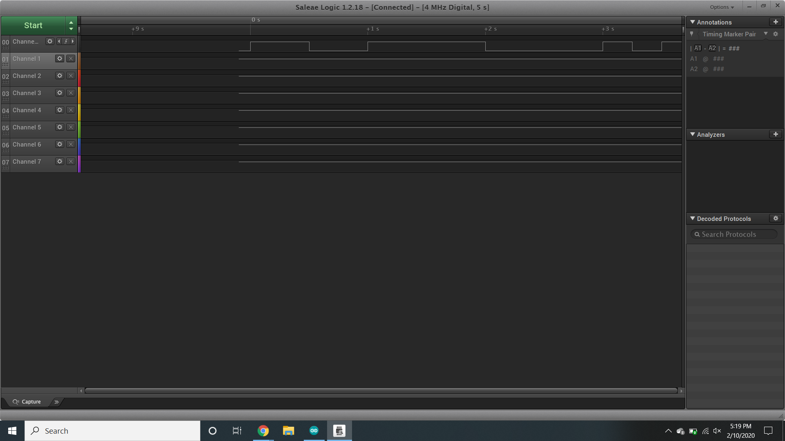
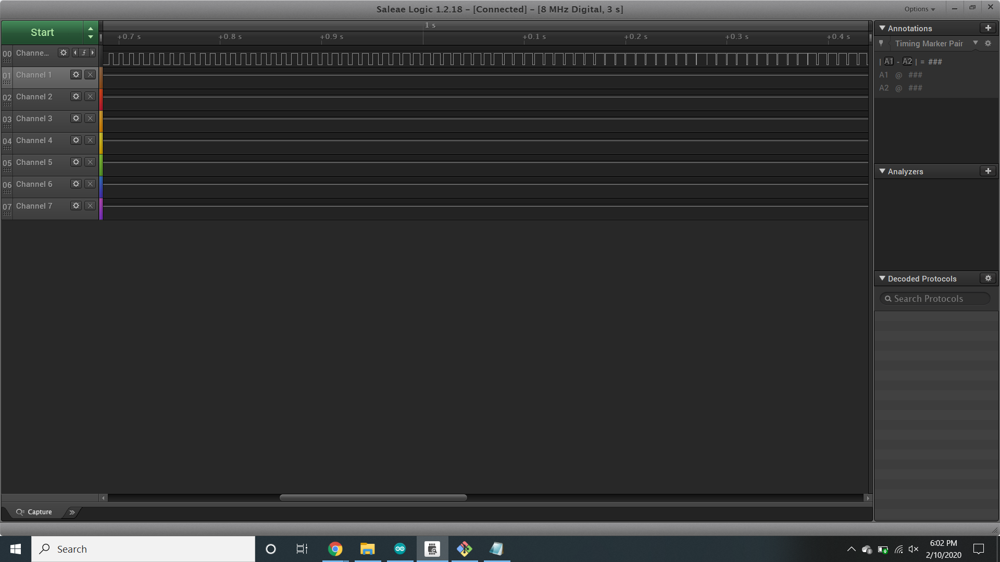
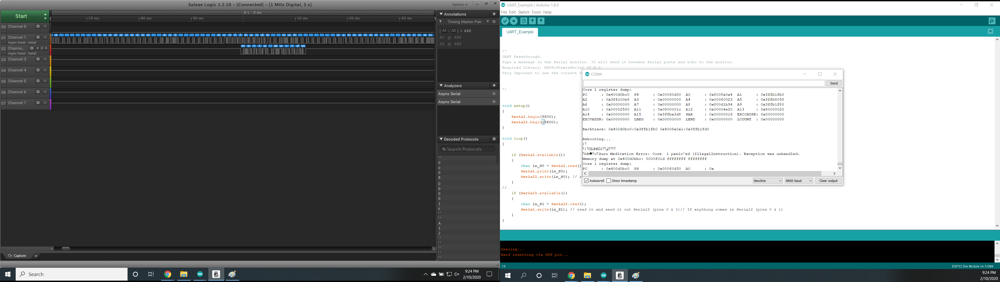
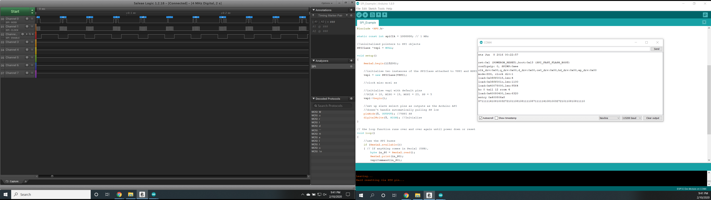

Name: Alvin Zhang

EID: ayz249

Team Number: F1

## Questions

1. Why does your program need a setup and a loop?

    The setup initializes and sets initial values, while loop continuously runs to allow the board to change and respond to inputs and outputs (in other words it allows the board to function).

2. What is the downside to putting all your code in a loop?

    The purpose of each segment of code becomes unclear since it is all in one massive cluster. Separating related code into functions allows better organization and easier understanding of the code.

3. Why does your code need to be compiled?

    So that the code, which is human readable, becomes readable to the machine.

4. When lowering the frequency in procedure A, step 4, what is going wrong? Brainstorm some solutions. Dimmers exist in the real world. What is their solution?

    The light starts flickering because the eye starts detecting the periods when the LED is and is not on. A solution is to maintain the frequency while decreasing the duty cycle.

5. Why do you need to connect the logic analyzer ground to the ESP32 ground?

    So that it is a complete circuit.

6. What is the difference between synchronous and asynchronous communication?

    Synchronous communication is when both the sender and the receiver are on a synchronized clock to allow for real time data transmission. While Asynchronous communication switches out the clock in favor of a parity bit.

7. Profile of UART: Sent X bytes in Y time 

    Sent 12 bytes in 12.5 ms

8. Profile of SPI: Sent X bytes in Y time

    Sent 12 bytes in 0.3185 ms

9. Why is SPI so much faster than UART?

    Because each direction of communication has its own line. UART also doesn't have a clock to synchronize data.

10. list one pro and one con of UART

    UART doesn't require a clock connection but it cannot support multiple master and slaves.

11. list one pro and one con of SPI

    Separate MISO and MOSI allow data to be transmitted and received at the same time, increasing speed. However, this means it takes up more lines and pins to operate.

12. list one pro and one con of I2C

    It supports multiple master and slave connections, but is slow because of its open drain design. It is also very sensitive to noise.

13. Why does I2C need external resistors to work?

    Since I2C lines are open drain, they require pull-up or pull-down resistors.

## Screenshots

Procedure A, step 1:

Procedure A, step 4:

Procedure B, UART:

Procedure B, SPI:

